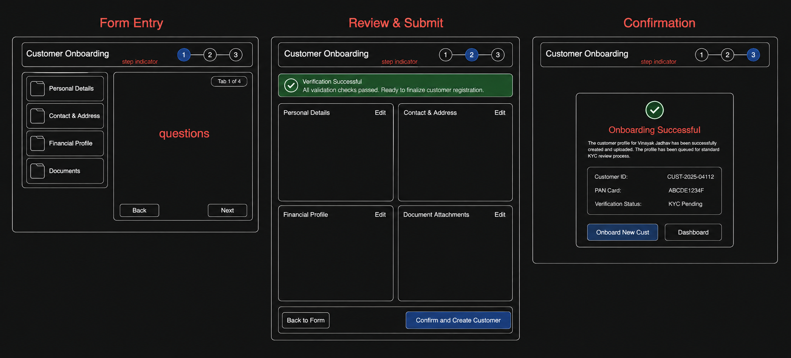

# FinBowl Engineering Assessment Submission

This repository contains my submission for the FinBowl Front-End Engineering assessment. The project is built using React, Vite, and Tailwind CSS, focusing on clean architecture, pixel-perfect designs, and complete mobile responsiveness.

---

## 🚀 What This Assignment Covers

This assessment covers the required front-end development tasks and data-fetching demonstrations:

### 1. Task 1: Design-to-Code (Loans & Disbursement Pages)
For the main application, I translated the provided Figma layouts into fully interactive, pixel-perfect React pages:
*   **Loans Creation Form** — [🔗 Open Form Path (/)](https://gracia-six.vercel.app/): A detailed onboarding interface with sections for Customer Info, Loan Details, Executive details, and Multi-Broker mapping. The **Add Loan** button remains disabled until all mandatory input fields are completed.
*   **Loan Details Screen** — [🔗 Open Details Path (/loan-detail)](https://gracia-six.vercel.app/loan-detail): Populated dynamically from the form submission. It computes ledger calculations in real-time.
*   **Disbursement Page** — [🔗 Open Disbursement Path (/disbursement)](https://gracia-six.vercel.app/disbursement): Renders KPI summaries, filter controls, full search query capability, and a paginated transaction grid. It is built to support horizontal table scroll handling on small viewports so the layout remains clean.

### 2. Task 2: Original Customer Onboarding Flow
*   **Figma Mockups & Coding**: Since I don't have extensive hands-on experience designing within Figma, I mapped out the initial layout as wireframes and focused my efforts on coding the screens directly in high-fidelity. I have attached the wireframe sheet below for reference.
    
    
*   **Implementation**: Accessible via the sidebar under **Onboard Customer** (routes: [🔗 /task2/onboarding](https://gracia-six.vercel.app/task2/onboarding) and [🔗 /task2/review](https://gracia-six.vercel.app/task2/review)).
*   **Features**:
    *   A responsive tabbed interface (Personal Details, Contact Info, Financial Profile, Document Upload) that collapses from a sidebar on desktop to a horizontal tab bar on mobile.
    *   A shared context provider (`OnboardingContext`) ensuring no data loss when transitioning between tabs.
    *   A review step displaying a summary panel with direct shortcuts to jump back and edit incomplete inputs, followed by a post-submit success confirmation screen.

---

## 🔌 Task 3: Connecting the Frontend to Live Data

To connect the Loans page or any component to a backend REST API in a real production app, I would isolate the data-fetching logic inside a custom React hook using **Axios**. This separates UI rendering from state synchronization and network handling.

Here is the code snippet demonstrating this structure, including custom headers, loading states, error boundaries, and connection cleanup on unmount:

```javascript
import { useState, useEffect } from 'react';
import axios from 'axios';

/**
 * Custom hook to fetch individual loan details by ID.
 * Features: Request cancellation on unmount, authorization headers,
 * and loading/error states.
 */
export function useLoanDetails(loanId) {
  const [loan, setLoan] = useState(null);
  const [loading, setLoading] = useState(true);
  const [error, setError] = useState(null);

  useEffect(() => {
    // Generate cancel token to avoid memory leaks if component unmounts mid-request
    const cancelTokenSource = axios.CancelToken.source();

    const fetchDetails = async () => {
      try {
        setLoading(true);
        const response = await axios.get(`/api/loans/${loanId}`, {
          cancelToken: cancelTokenSource.token,
          headers: {
            'Content-Type': 'application/json',
            // Inject JWT token retrieved from local storage
            'Authorization': `Bearer ${localStorage.getItem('user_token')}`
          }
        });
        
        setLoan(response.data);
        setError(null);
      } catch (err) {
        if (!axios.isCancel(err)) {
          // Track API validation message or fallback to default
          const errorMessage = err.response?.data?.message || 'Failed to fetch loan details.';
          setError(errorMessage);
        }
      } finally {
        setLoading(false);
      }
    };

    if (loanId) {
      fetchDetails();
    }

    // Cleanup: cancel pending request when loanId changes or component unmounts
    return () => {
      cancelTokenSource.cancel('Component unmounted, cleaning up fetch request.');
    };
  }, [loanId]);

  return { loan, loading, error };
}
```

### In-Component Usage:
We would use this custom hook inside the [LoanDetail](file:///d:/Gracia/client/src/pages/LoanDetail.jsx) page as follows:

```javascript
import React from 'react';
import { useParams } from 'react-router-dom';
import { useLoanDetails } from '../hooks/useLoanDetails';

export default function LoanDetailView() {
  const { id } = useParams();
  const { loan, loading, error } = useLoanDetails(id);

  if (loading) return <div className="p-8 text-center text-subtle">Retrieving loan file...</div>;
  if (error) return <div className="p-8 text-center text-req font-bold">Error: {error}</div>;

  return (
    <div>
      <h2>{loan.customerName}</h2>
      <p>Amount: {loan.loanAmount}</p>
    </div>
  );
}
```

---

## 🛠️ Installation & Setup

1.  **Navigate into the client workspace**:
    ```bash
    cd client
    ```
2.  **Install dependencies**:
    ```bash
    npm install
    ```
3.  **Run in local development mode**:
    ```bash
    npm run dev
    ```
    The application will run locally at `http://localhost:5173/`.
4.  **Build production artifacts**:
    ```bash
    npm run build
    ```

---

## 📁 Folder Structure (Client)

```text
client/
├── src/
│   ├── components/
│   │   ├── dashboard/       # Sidebar, Topbar, Layout wrappers
│   │   └── ui/              # Atom-level component design tokens (buttons, tables)
│   ├── hooks/               # Custom screen state hooks
│   ├── lib/                 # Core utils (class-merging helpers)
│   ├── pages/               # Main Page views & context states
│   │   ├── task2/           # Onboarding Form & Review pages (Task 2)
│   │   ├── LoanContext.jsx  # Main application share context
│   │   ├── LoanDetail.jsx   # Loan details grid
│   │   └── Disbursement.jsx # Disbursement counters and table grid
│   ├── App.jsx              # Main routing declaration
│   ├── index.css            # Custom CSS themes & Tailwind directives
│   └── main.jsx             # Entrypoint script
├── vite.config.js           # Alias paths configuration
└── tsconfig.json            # esbuild compilation mappings
```
